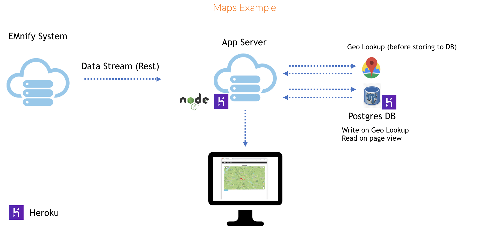

= Datastreamer Maps Example

A node.js application using a Rest API data streamer to update an embedded map with location data.

*Prerequisites:*

* https://nodejs.org/en/[node.js]
* https://devcenter.heroku.com/articles/heroku-cli[Heroku CLI]
* https://console.cloud.google.com/apis/credentials[Google Maps API Keys]

== Getting Started

From the project root, create a Heroku app:

[source,bash]
----
heroku create
----

Provision a Postgres DB:

[source,bash]
----
# create
heroku addons:create heroku-postgresql:hobby-dev
# verify
heroku pg:info
----

> Note: As part of the provisioning process, a `DATABASE_URL` config var is added to the Heroku app’s configuration.
To use this DB from a local instance, use dotenv as detailed in the 'Development' section below.

Set environment variables for the Google Maps geolookup calls:

[source,bash]
----
heroku config:set API_KEY=<my_google_maps_api_key>
----

Deploy to Heroku and confirm the application is running:

[source,bash]
----
# Deploy current Master
git push heroku master
# Get application logs
heroku logs --tail
----

== Streaming Platform Data

1. Navigate to the EUI https://cdn.emnify.net/eui/#/tech_settings[tech settings] page
2. Click *+ Add Data Stream*
3. Select *Usage Data & Events* for Data Stream Type and *RestAPI* for API Type
4. Click the 'cog' settings button to add a new API URL
5. Enter the app URL (e.g. `https://<my_app_url>.herokuapp.com`) and click *+*
6. Select the new URL from the list of available API URLs
7. Click *Add Data Stream*

If the connection is working as expected, a `200` success code will be shown in the EUI for that stream when new events occur.

== Development

The `DATABASE_URL` value can be found using the following command (after `Connection URL:`):

[source,bash]
----
heroku pg:credentials:url
----

Create a file named `.env` in the project root which contains the Maps API and Postgres credentials in the following format:

[source,bash]
----
API_KEY=<my_google_maps_api_key>
DATABASE_URL=postgres://<username>:<long-password>@<server_ip>.eu-west-1.compute.amazonaws.com:<port>/<app>
----

> The .env file should not be committed to git history as it contains your app secrets!

Run locally using:

[source,bash]
----
npm install
node index.js
----

=== Templates

The project uses the EJS templating engine. For the main application pages, the templates can be found in `./views/pages`

=== Helper Functions

The main application logic is located in the `index.js` file. Some helper functions are added to the `helpers.js` and are exported for use elsewhere.

== Resources

* https://devcenter.heroku.com/articles/getting-started-with-nodejs[Getting tarted with Node.js on Heroku]
* https://devcenter.heroku.com/articles/heroku-postgresql#provisioning-heroku-postgres[Deploying Postgres on Heroku]
* https://ejs.co/[EJS Templating Reference]
* https://developers.google.com/maps/documentation/javascript/adding-a-google-map[Google Maps Javascript Examples]

