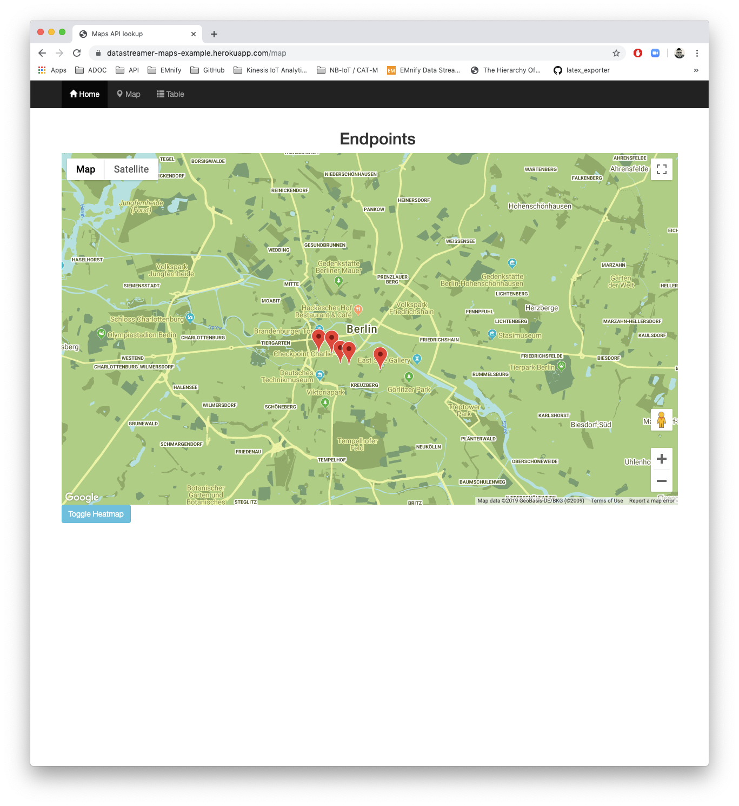

= Datastreamer Maps Example

A node.js application using a Rest API data streamer to update an embedded map with location data.

image::doc/node-maps-example.png[]

*Prerequisites:*

* https://nodejs.org/en/[node.js]
* https://devcenter.heroku.com/articles/heroku-cli[Heroku CLI]
* https://console.cloud.google.com/apis/credentials[Google Maps API Keys]

== Getting Started

From the project root, create a Heroku app and make note of the application name:

[source,bash]
----
$ heroku create
Creating app... done, ⬢ <heroku_app_name>
----

Set the Google Maps API key for geolookup and maps queries:

[source,bash]
----
$ heroku config:set API_KEY=<my_google_maps_api_key>
----

Provision a Postgres DB:

[source,bash]
----
$ heroku addons:create heroku-postgresql:hobby-dev
----

Make a note of the DB addon name:

[source,bash]
----
$ heroku pg:info
----

The addon name is shown at the bottom in the format `postgresql-<random_name>`:

[source,bash]
----
...
Add-on:                postgresql-<random_name>
----

Create a table `coords_table` in your DB (see above for the values to replace in `<postgres_addon_name>` and `<heroku_app_name>`):

[source,bash]
----
$ heroku pg:psql <postgres_addon_name> --app <heroku_app_name>
----

At the point where you have `<heroku_app_name>::DATABASE=>` in the terminal, create a table and set the schema for `coords_table` using the following command and type `exit` when finished:

[source,sql]
----
CREATE TABLE coords_table (
  ID SERIAL PRIMARY KEY,
  timestamp timestamp,
  endpoint_id bigint,
  endpoint_name varchar,
  lat numeric,
  long numeric,
  accuracy numeric
);
----

Deploy to Heroku and confirm the application is running:

[source,bash]
----
$ git push heroku master
$ heroku logs --tail
----

A small test script is added to post dummy data toward the DB to ensure your application is set up correctly.
Edit the `post-pdp.sh` script to have contain your application server URL and run it:

[source,bash]
----
$ ./post-pdp.sh
----

If configured correctly, your application should show a single test entry on the map.

== Streaming Platform Data

1. Navigate to the EUI https://cdn.emnify.net/eui/#/tech_settings[tech settings] page
2. Click *+ Add Data Stream*
3. Select *Usage Data & Events* for Data Stream Type and *RestAPI* for API Type
4. Click the 'cog' settings button to add a new API URL
5. Enter the app URL (e.g. `https://<my_app_url>.herokuapp.com`) and click *+*
6. Select the new URL from the list of available API URLs
7. Click *Add Data Stream*

If the connection is working as expected, a `200` success code will be shown in the EUI for that stream when new events occur.

== Development

The `DATABASE_URL` value can be found using the following command (after `Connection URL:`):

[source,bash]
----
$ heroku pg:credentials:url
----

Create a file named `.env` in the project root which contains the Maps API and Postgres credentials in the following format:

[source,bash]
----
API_KEY=<my_google_maps_api_key>
DATABASE_URL=postgres://<username>:<long-password>@<server_ip>.eu-west-1.compute.amazonaws.com:<port>/<app>
----

> The .env file should not be committed to git history as it contains your app secrets!

Run locally using:

[source,bash]
----
$ npm install
$ node index.js
----

> To permanently reset the DB, run `heroku pg:reset postgresql-<addon_name> --confirm <hroku_app_name>`. This can also be done in the browser at https://dashboard.heroku.com/apps/<app_name>/resources

=== Templates

The project uses the EJS templating engine. For the main application pages, the templates can be found in `./views/pages`

=== Helper Functions

The main application logic is located in the `index.js` file. Some helper functions are added to the `helpers.js` and are exported for use elsewhere.

== Resources

* https://devcenter.heroku.com/articles/getting-started-with-nodejs[Getting started with Node.js on Heroku]
* https://devcenter.heroku.com/articles/heroku-postgresql#provisioning-heroku-postgres[Deploying Postgres on Heroku]
* https://ejs.co/[EJS Templating Reference]
* https://developers.google.com/maps/documentation/javascript/adding-a-google-map[Google Maps Javascript Examples]

